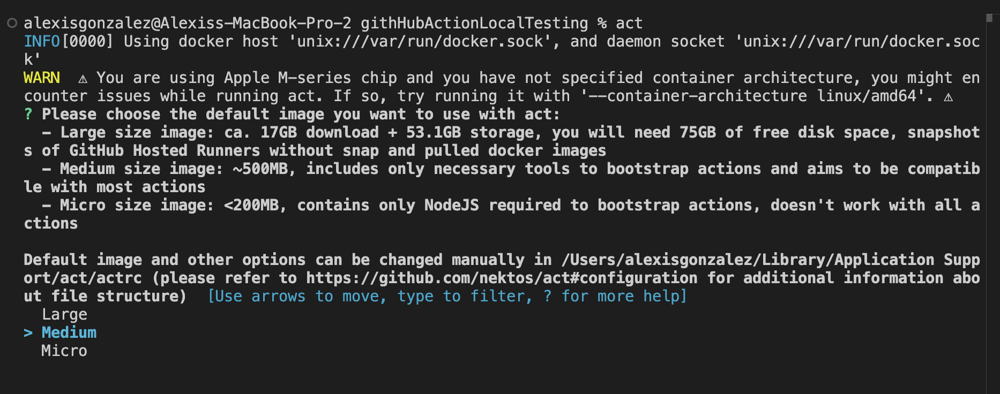
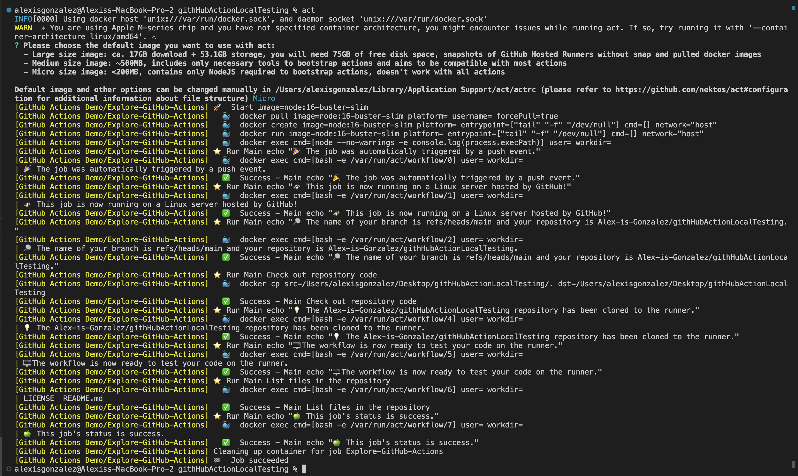

# GithHub Action Local Testing

The problem starts when you're testing GitHub Actions. It can be time-consuming and painful. First, you have to change the GitHub Actions file locally, push your local code into your GitHub repository, and wait for the result.

To solve this issue, You can use the act CLI tool to test and write the GitHub action locally. With act CLI, you do not need to commit/push your local code to the GitHub Repository. You test GitHub action locally on your laptop or machine.

## Using ACT to test GitHub actions Locally

ACT is a tool used to test and run GitHub Actions workflows locally on your machine, emulating the GitHub Actions environment. It enables developers to validate workflows without needing to push code to a repository and execute the actions in GitHub's cloud environment. This saves time and resources during development and debugging.

Key Features of ACT:

- Local Testing: Test workflows on your local machine, using your environment or Docker to simulate the GitHub Actions runtime.
- Speed: Avoid the push-commit-debug cycle; iterate faster by testing workflows in real-time.
- Simulated Environments: ACT provides different Docker containers that mimic the GitHub-hosted runner environments.

## Prerequisits

You will need to install Docker inorder to test your GitHub Actions Locally.
Install [Docker](https://www.docker.com/)

Install actCLI

```
# Window
choco install act-cli

# MacOS
brew install act

# Linux
curl https://raw.githubusercontent.com/nektos/act/master/install.sh | sudo bash
```

## How to Configure and Initialize the act CLI

Install act CLI, run the following command in your project directory

```
# Window
$ choco install act-cli

# MacOS
$ brew install act

# Linux
$ curl https://raw.githubusercontent.com/nektos/act/master/install.sh | sudo bash
```

After the act CLI installation is successful on your laptop or machine, the next step is to run it in your project. act CLI asks which Docker image size—large, medium, or micro—must be installed during installation.

```bash
$ act
```

There are various Docker image sizes:

The Docker Micro image size is 200 MB, and small projects use it.
The Docker Medium image size is 500 MB, and Big Project uses it.
The Docker Large image size is 17 GB, and Enterprise uses it.
The act CLI uses the Docker image to run the GitHub action locally.

In this case, select `Mirco` as it is simple action being ran.



Once the action is ran you will see the logs in which you can use to debug and test. In this case below all jobs have been excuted without any errors.



## How to Run a Specfic Workflow

This repository only contains one workflow, but what if you didn't want to run all workflows?
Run a Workflow: Navigate to the root of your repository and run ACT:

- To run the default event in your workflow:

```bash
 $ act
```

- To specify an event type:

```bash
$ act <event_name>

For example, to test a push event:

$ act push
```

- Use Docker Images: ACT uses Docker to simulate GitHub Actions environments. You can specify the runner image:

ubuntu-latest equivalent:

```
$ act -P ubuntu-latest=ghcr.io/catthehacker/ubuntu:full-latest
```

- Secrets and Variables: Provide secrets and environment variables locally by using a .secrets file or passing them in the command:

```
$ act -s MY_SECRET=secret_value
```

## Example Workflow Testing

Suppose you have a workflow that runs tests on push. To test it locally:

1. Ensure your Docker is running.

2. Run ACT for the push event:

```bash
$ act push
```

ACT will simulate the workflow, display logs, and show if any steps fail, allowing you to debug locally.
